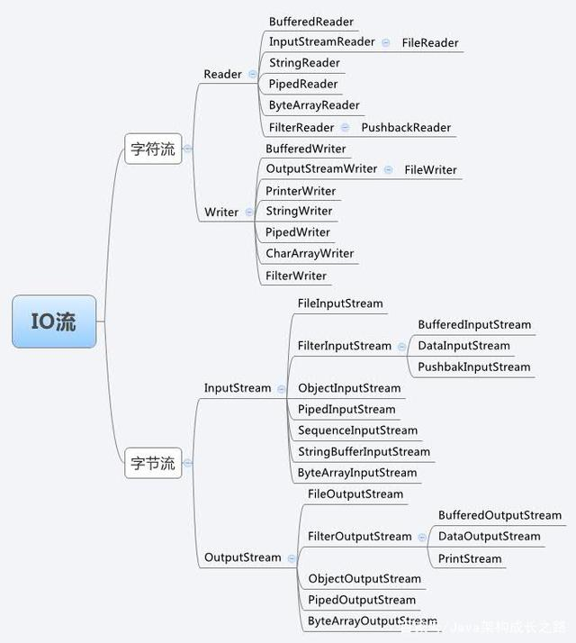
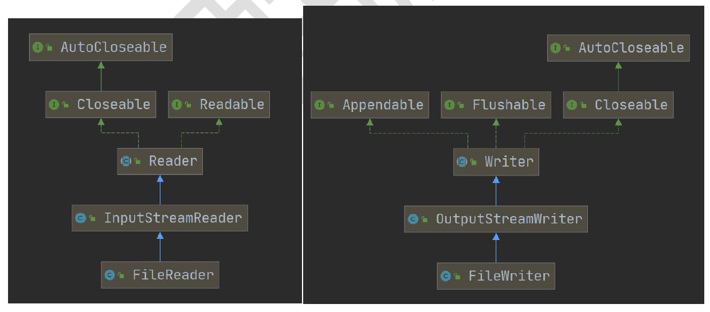
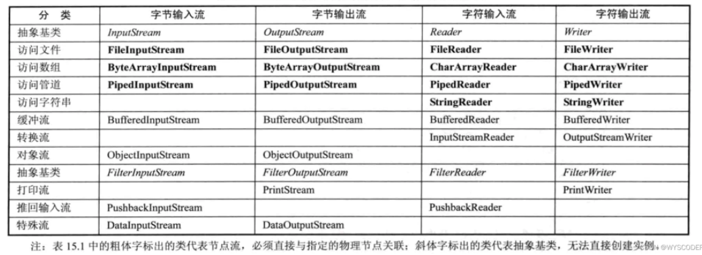
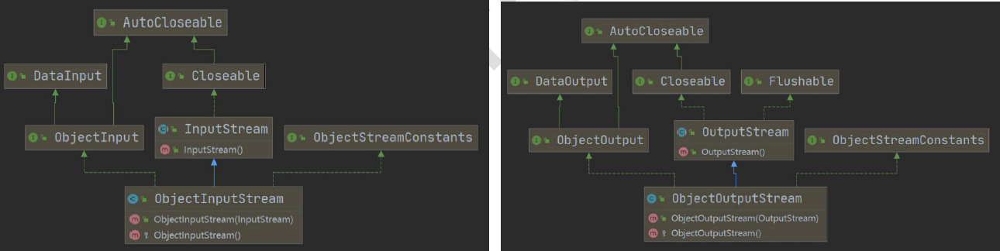
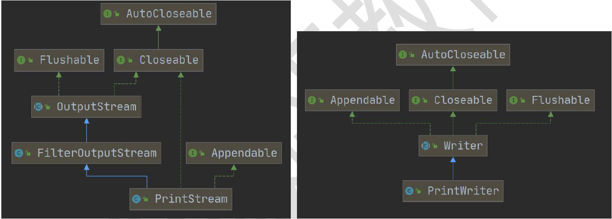

# 文件

## 常用文件操作

### 创建文件相关构造器和方法

```java
new File(String pathname)
new File(File parent,String child) //根据父目录文件+子路径构建
new File(String parent,String child) //根据父目录+子路径构建
    
//getName、getAbsolutePath、getParent、length、exists、isFile、isDirectory
file.createNewFile();
file.getName());
file.getAbsolutePath());
file.getParent());
file.length());
file.exists());
file.isFile());
file.isDirectory();
```

## IO流原理及流的分类

### 流的分类

按操作数据单位不同分为：字节流（8 bit)二进制文件，字符流文本文件

按数据流的流向分为：输入流，输出流

按流的角色不同分为：节点流，处理流/包装流

| 抽象基类 | 字节流       | 字符流 |
| -------- | :----------- | :----: |
| 输入流   | InputStream  | Reader |
| 输出流   | OutputStream | Writer |

1. java IO流40多个基类都是从如上四个基类派生

2. 子类名称以其父类名作为子类名后缀

## IO流体系图-常用的类

### 体系图



### FileInputStream

单个字节的读取，效率比较低。

```java
String filePath = "e:\\hello.txt";
int readData = 0;
FileInputStream fileInputStream = null;
try {
    //创建 FileInputStream 对象，用于读取 文件
    fileInputStream = new FileInputStream(filePath);
    //从该输入流读取一个字节的数据。 如果没有输入可用，此方法将阻止。
    //如果返回-1 , 表示读取完毕
    while ((readData = fileInputStream.read()) != -1) {
        System.out.print((char) readData);
        //转成char显示
    }
} catch (IOException e) {
    e.printStackTrace();
} finally {
    //关闭文件流，释放资源.
    try {
        fileInputStream.close();
    } catch (IOException e) {
        e.printStackTrace();
    }
}
```

使用 read(byte[] b) 读取文件，提高效率

```java
String filePath = "e:\\hello.txt";
//字节数组
byte[] buf = new byte[8]; //一次读取8个字节.
int readLen = 0;
FileInputStream fileInputStream = null;
try {
    //创建 FileInputStream 对象，用于读取 文件
    fileInputStream = new FileInputStream(filePath);
    //从该输入流读取最多b.length字节的数据到字节数组。 此方法将阻塞，直到某些输入可用。
    //如果返回-1 , 表示读取完毕
    //如果读取正常, 返回实际读取的字节数
    while ((readLen = fileInputStream.read(buf)) != -1) {
        System.out.print(new String(buf, 0, readLen));//显示
    }
} catch (IOException e) {
    e.printStackTrace();
} finally {
    //关闭文件流，释放资源.
    try {
        fileInputStream.close();
    } catch (IOException e) {
        e.printStackTrace();
    }
}
```

### FileOutputStream

```java
//1. new FileOutputStream(filePath) 创建方式，当写入内容是，会覆盖原来的内容
//2. new FileOutputStream(filePath, true) 创建方式，当写入内容是，是追加到文件后面
fileOutputStream = new FileOutputStream(filePath);
fileOutputStream.write('H');
//写入字符串
String str = "hsp,world!";
fileOutputStream.write(str.getBytes());
/*
write(byte[] b, int off, int len) 将 len字节从位于偏移量 off的指定字节数组写入此文件输出流
 */
fileOutputStream.write(str.getBytes(), 0, 3);
```

### FileReader 与 FileWriter



#### FileReader

```java
String filePath = "e:\\story.txt";
FileReader fileReader = null;
int data = 0;
//1. 创建FileReader对象
try {
    fileReader = new FileReader(filePath);
    //循环读取 使用read, 单个字符读取
    while ((data = fileReader.read()) != -1) {
        System.out.print((char) data);
    }
} catch (IOException e) {
    e.printStackTrace();
} finally {
    try {
        if (fileReader != null) {
            fileReader.close();
        }
    } catch (IOException e) {
        e.printStackTrace();
    }
}
```

```java
String filePath = "e:\\story.txt";
FileReader fileReader = null;
int readLen = 0;
char[] buf = new char[128];
//1. 创建FileReader对象
try {
    fileReader = new FileReader(filePath);
    //循环读取 使用read(buf), 返回的是实际读取到的字符数
    //如果返回-1, 说明到文件结束
    while ((readLen = fileReader.read(buf)) != -1) {
        System.out.print(new String(buf, 0, readLen));
    }
} catch (IOException e) {
    e.printStackTrace();
} finally {
    try {
        if (fileReader != null) {
            fileReader.close();
        }
    } catch (IOException e) {
        e.printStackTrace();
    }
}
```

#### FileWriter

```java
String filePath = "e:\\note.txt";
//创建FileWriter对象
FileWriter fileWriter = null;
char[] chars = {'a', 'b', 'c'};
try {
    fileWriter = new FileWriter(filePath);
    // 默认是覆盖写入
    // fileWriter = new FileWriter(filePath，true);
    // 3) write(int):写入单个字符
    fileWriter.write('H');
    //  4) write(char[]):写入指定数组
    fileWriter.write(chars);
    //  5) write(char[],off,len):写入指定数组的指定部分
    fileWriter.write("韩顺平教育".toCharArray(), 0, 3);
    //  6) write（string）：写入整个字符串
    fileWriter.write(" 你好北京~");
    fileWriter.write("风雨之后，定见彩虹");
    //  7) write(string,off,len):写入字符串的指定部分
    fileWriter.write("上海天津", 0, 2);
    //在数据量大的情况下，可以使用循环操作.
```

##  处理流

### 节点流和处理流的区别联系

***处理流连接在已存在的流（节点流或处理流）上，为程序提供更强大的读写功能***



1. 节点流是底层流/低级流，直接和数据流相连
2. 处理流包装节点流，既可以消除不同节点流的实现差异，也可以提供更方便的方法完成输入输出
3. 处理流对节点流进行包装，使用了修饰器设计模式，不会直接与数据相连

### 处理流的功能

1. 性能的提高：主要增加缓冲的方式来提高输入输出的效率
2. 操作的便捷：提供了一系列便捷的方法来一次输入大批量的数据

###  BufferedReader 和 BufferedWriter

BufferedReader 和 BufferedWriter属于字符流，按字符读取数据

关闭流时，关闭外层流即可

#### BufferedReader

```java
String filePath = "e:\\a.java";
//创建bufferedReader
BufferedReader bufferedReader = new BufferedReader(new FileReader(filePath));
//读取
String line; //按行读取, 效率高
//说明
//1. bufferedReader.readLine() 是按行读取文件
//2. 当返回null 时，表示文件读取完毕
while ((line = bufferedReader.readLine()) != null) {
    System.out.println(line);
}
//关闭流, 这里注意，只需要关闭 BufferedReader ，因为底层会自动的去关闭 节点流
//FileReader。
/*
    public void close() throws IOException {
        synchronized (lock) {
            if (in == null)
                return;
            try {
                in.close();//in 就是我们传入的 new FileReader(filePath), 关闭了.
            } finally {
                in = null;
                cb = null;
            }
        }
    }
 */
bufferedReader.close();
```

####  BufferedWriter

```java
//创建BufferedWriter
//说明:
//1. new FileWriter(filePath, true) 表示以追加的方式写入
//2. new FileWriter(filePath) , 表示以覆盖的方式写入
BufferedWriter bufferedWriter = new BufferedWriter(new FileWriter(filePath,true));
bufferedWriter.write("hello, 韩顺平教育!");
bufferedWriter.newLine();//插入一个和系统相关的换行
bufferedWriter.write("hello2, 韩顺平教育!");
bufferedWriter.newLine();
bufferedWriter.write("hello3, 韩顺平教育!");
bufferedWriter.newLine();
//说明：关闭外层流即可 ， 传入的 new FileWriter(filePath) ,会在底层关闭
bufferedWriter.close();
BufferedReader bufferedReader = new BufferedReader(new FileReader(filePath));
String line;
while ((line = bufferedReader.readLine()) != null){
    System.out.println(line);
}
bufferedReader.close();
```

### BufferedInputStream和BufferedOutputStream

```java
try {
    bis = new BufferedInputStream(new FileInputStream(srcFilePath));
    bos = new BufferedOutputStream(new FileOutputStream(destFilePath));
    byte[]  buff = new byte[1023];
    int readLen = 0;
    while ((readLen = bis.read(buff)) != -1){
        bos.write(buff,0,readLen);
    }
    System.out.println("ok");
} catch (IOException e) {
    throw new RuntimeException(e);
} finally {
    try {
        bis.close();
        bos.close();
    } catch (IOException e) {
        throw new RuntimeException(e);
    }
}
```

1. BufferedInputStream只有`read()`方法

   `read()`读取一个字节，`read(byte{[]})`读取字节数组返回读取长度。

2. BufferedReader有`read()`和`readLine()`两种读取方法。

   `read()`读取一个字符

### 对象流
ObjectInputStream和ObjectOutputStream
#### **序列化和反序列化**

1. 序列化是在保存数据时，保存数据的值和数据类型
2. 反序列化实在恢复数据时，恢复数据的值和数据类型
3. 类必须实现如下两个接口之一才能支持序列化机制：
   1. **Serializable**,标记接口，没有方法
   2. Externalizable，有方法需要实现



#### ObjectOutputStream

```java
//序列化后，保存的文件格式，不是存文本，而是按照他的格式来保存
String filePath = "e:\\data.dat";
ObjectOutputStream oos = new ObjectOutputStream(new FileOutputStream(filePath));
//序列化数据到 e:\data.dat
oos.writeInt(100);
// int -> Integer (实现了 Serializable)
oos.writeBoolean(true);
// boolean -> Boolean (实现了 Serializable)
oos.writeChar('a');
// char -> Character (实现了 Serializable)
oos.writeDouble(9.5);
// double -> Double (实现了 Serializable)
oos.writeUTF("韩顺平教育");
//String
//保存一个dog对象
oos.writeObject(new Dog("旺财", 10, "日本", "白色"));
oos.close();
```

#### ObjectInputStream

```java
//指定反序列化的文件
String filePath = "e:\\data.dat";
ObjectInputStream ois = new ObjectInputStream(new FileInputStream(filePath));
//读取
//老师解读
//1. 读取(反序列化)的顺序需要和你保存数据(序列化)的顺序一致
//2. 否则会出现异常
System.out.println(ois.readInt());
System.out.println(ois.readBoolean());
System.out.println(ois.readChar());
System.out.println(ois.readDouble());
System.out.println(ois.readUTF());
//dog 的编译类型是 Object , dog 的运行类型是 Dog
Object dog = ois.readObject();
System.out.println("运行类型=" + dog.getClass());
System.out.println("dog信息=" + dog);//底层 Object -> Dog
//这里是特别重要的细节:
//1. 如果我们希望调用Dog的方法, 需要向下转型
//2. 需要我们将Dog类的定义，放在到可以引用的位置
Dog dog2 = (Dog)dog;
System.out.println(dog2.getName()); //旺财..
//关闭流, 关闭外层流即可，底层会关闭 FileInputStream 流
ois.close();
```

#### 注意事项

1. 读写顺序一致
2. 序列化或反序列化对象，需要实现Serializable
3. 序列化对象类中建议添加SerialVersionUID，提高版本兼容性
4. 序列化对象时，默认将所有属性序列化，除了static和transient修饰的成员
5. 序列化对象的属性也要是可序列化的
6. 序列化具备可继承性，如果某类已经实现了序列化，则它的所有子类也已经默认实现了序列化

### 标准输入输出流

|                    | 类型        | 默认设备 |
| ------------------ | ----------- | -------- |
| System.in标准输入  | InputStream | 键盘     |
| System.out标准输出 | PrintStream | 显示器   |

### 转换流

InputStreamReader和OutputStreamWriter

1. InputStreamReader:Reader的子类，可以将InputStream（字节流）包装成（转换）Reader（字节流）
2. OutputStreamWriter: Writer的子类
3. 可以在使用时指定编码格式（utf-8,gbk,gb2312等)

#### InputStreamReader

```java
String filePath = "e:\\a.txt";
//解读
//1. 把 FileInputStream 转成 InputStreamReader
//2. 指定编码 gbk
//InputStreamReader isr = new InputStreamReader(new FileInputStream(filePath), "gbk");
//3. 把 InputStreamReader 传入 BufferedReader
//BufferedReader br = new BufferedReader(isr);
//将2 和 3 合在一起
BufferedReader br = new BufferedReader(new InputStreamReader(new FileInputStream(filePath), "gbk"));
//4. 读取
String s = br.readLine();
System.out.println("读取内容=" + s);
//5. 关闭外层流
br.close();
```

#### OutputStreamWriter

```java
String filePath = "e:\\hsp.txt";
String charSet = "utf-8";
OutputStreamWriter osw = new OutputStreamWriter(new FileOutputStream(filePath), charSet);
osw.write("hi, 韩顺平教育");
osw.close();
System.out.println("按照 " + charSet + " 保存文件成功~");
```

## 打印流

打印流只有输出流，没有输入流



### PrintWriter

```java
//PrintWriter printWriter = new PrintWriter(System.out);
PrintWriter printWriter = new PrintWriter(new FileWriter("e:\\f2.txt"));
printWriter.print("hi, 北京你好~~~~");
printWriter.close();//flush + 关闭流, 才会将数据写入到文件..
```

### PrintStream

```java
PrintStream out = System.out;
//在默认情况下，PrintStream 输出数据的位置是 标准输出，即显示器
/*
     public void print(String s) {
        if (s == null) {
            s = "null";
        }
        write(s);
    }
 */
out.print("john, hello");
//因为print底层使用的是write , 所以我们可以直接调用write进行打印/输出
out.write("韩顺平,你好".getBytes());
out.close();
//我们可以去修改打印流输出的位置/设备
//1. 输出修改成到 "e:\\f1.txt"
//2. "hello, 韩顺平教育~" 就会输出到 e:\f1.txt
//3. public static void setOut(PrintStream out) {
//        checkIO();
//        setOut0(out); // native 方法，修改了out
//   }
System.setOut(new PrintStream("e:\\f1.txt"));
System.out.println("hello, 韩顺平教育~");
```

## Properties类

1. 专门用于读写配置文件的集合类，底层是HashTable

   键=值

   键=值

2. 键值对不需要有空格，值不需要引号引起来。默认类型String

3. Properties的常见方法

   1. load:加载配置文件的键值对到Properties对象
   2. list:将数据显示到指定设备
   3. getProperty(key):
   4. setProperty(key,value)
   5. store:将Properties中的键值对存储到配置文件中。idea中，中文存储为unicode编码

```Java
//使用Properties 类来读取mysql.properties 文件
//1. 创建Properties 对象
Properties properties = new Properties();
//2. 加载指定配置文件
properties.load(new FileReader("src\\mysql.properties"));
//3. 把k-v显示控制台
properties.list(System.out);
//4. 根据key 获取对应的值
String user = properties.getProperty("user");
String pwd = properties.getProperty("pwd");
System.out.println("用户名=" + user);
System.out.println("密码是=" + pwd);
```

```java
//使用Properties 类来创建 配置文件, 修改配置文件内容
Properties properties = new Properties();
//创建
//1.如果该文件没有key 就是创建
//2.如果该文件有key ,就是修改
/*
    Properties 父类是 Hashtable ， 底层就是Hashtable 核心方法
    public synchronized V put(K key, V value) {
        // Make sure the value is not null
        if (value == null) {
            throw new NullPointerException();
        }
        // Makes sure the key is not already in the hashtable.
        Entry<?,?> tab[] = table;
        int hash = key.hashCode();
        int index = (hash & 0x7FFFFFFF) % tab.length;
        @SuppressWarnings("unchecked")
        Entry<K,V> entry = (Entry<K,V>)tab[index];
        for(; entry != null ; entry = entry.next) {
            if ((entry.hash == hash) && entry.key.equals(key)) {
                V old = entry.value;
                entry.value = value;//如果key 存在，就替换
                return old;
            }
        }
        addEntry(hash, key, value, index);//如果是新k, 就addEntry
        return null;
    }
 */
properties.setProperty("charset", "utf8");
properties.setProperty("user", "汤姆");//注意保存时，是中文的 unicode码值
properties.setProperty("pwd", "888888");
//将k-v 存储文件中即可
properties.store(new FileOutputStream("src\\mysql2.properties"),"csac");
System.out.println("保存配置文件成功~");
```
