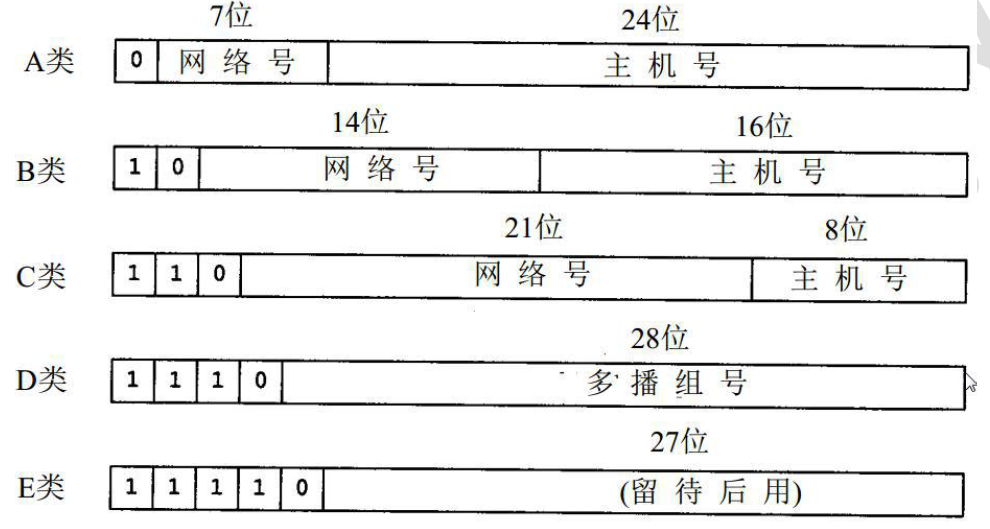
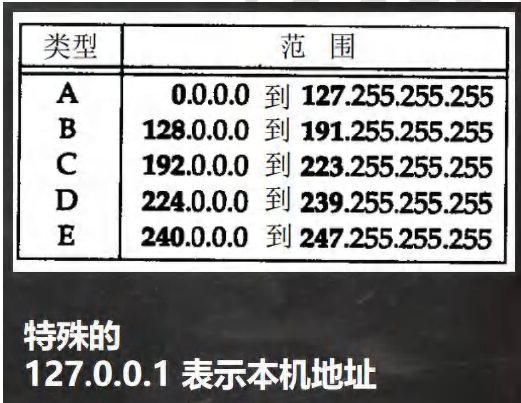

# 网络相关概念

## ip地址

概念：用于唯一标识网络中每台主机

查看ip地址：ipconfig

点分十进制表示: xx.xx.xx.xx

 ### ipv4

127.0.0.1本机地址

4个字节（32）位表示 0-255

ip地址=网络地址+主机地址

### ipv6

16个字节 128位表示地址

## 域名

www.baidu.com

将ip地址映射为域名，方便记忆

怎么映射，HTTP协议

## 端口号

1. 概念：用于标识计算机上某个网络程序

2. 表示形式：以整数形式，范围0-65535（2字节）
3. 0-1024 已经被占用，比如 ssh 22, ftp 21, smtp 25, http 80
4. 常见的网络程序端口号
   - tomcat: 8080
   - mysql: 3306
   - oracle: 1521
   - sqlserver: 1433

## 网络通信协议

## 网络模型

### OSI模型

### TCP/IP模型

